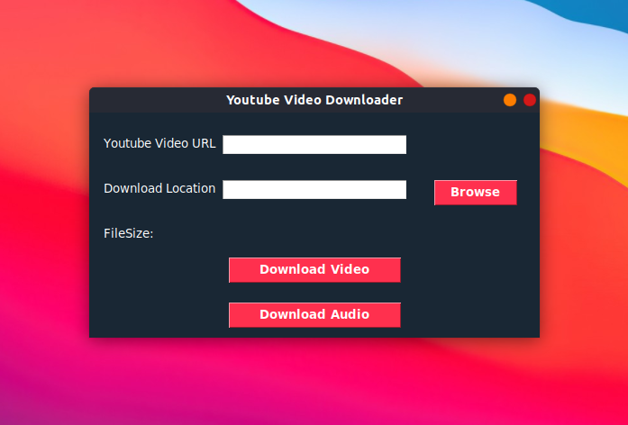

# Youtube-Video-Downloader
Just a Classic YouTube Video Downloader made with Python and Tkinter.


# Installation
## Ubuntu
1. Download the repo.
1. Extract the repo onto your desired path.
1. Open Terminal.
```
sudo apt-get install python3
sudo apt-get install python3-tk
```
1. Now go to this directory  *aryanfluxion/Youtube-Video-Downloader* on your file manager.
1. Right-Mouse-Click on the file manager.
1. Click on Open in Terminal.
```
python3 "path/GUI.py"
```

